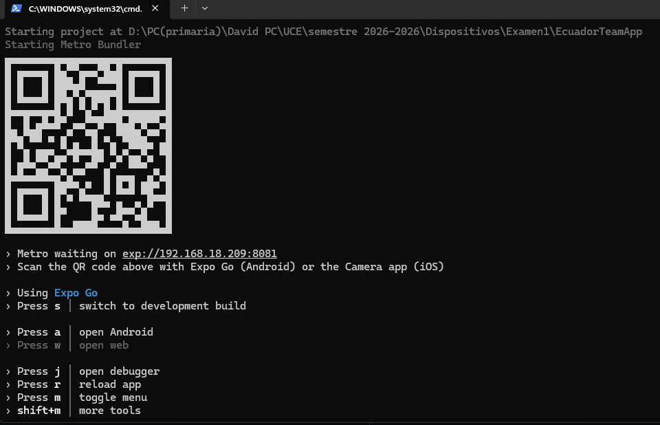

# Ecuador Team App

Aplicación móvil básica desarrollada con **React Native + Expo Go** que muestra información de la **Selección Ecuatoriana de Fútbol**.

## Características

- **Splash Screen**: Pantalla de bienvenida animada con el logo tricolor de Ecuador (amarillo, azul, rojo).
- **Home Screen**: Pantalla principal con información del equipo: fundación, ranking FIFA, director técnico, capitán, récords y logros.

## Estructura del proyecto

```
EcuadorTeamApp/
├── assets/                  # Recursos estáticos (icono, logo Ecuador)
├── src/
│   ├── data/
│   │   └── teamData.js      # Datos del equipo ecuatoriano
│   └── screens/
│       ├── SplashScreen.js  # Pantalla de bienvenida animada
│       └── HomeScreen.js    # Pantalla de inicio con info del equipo
├── App.js                   # Punto de entrada de la app
├── app.json                 # Configuración de Expo
├── package.json             # Dependencias del proyecto
├── setup.bat                # Script automatizado para Windows
├── Evidencia1.png           # QR del servidor Expo
├── Evidencia2.png           # Splash Screen en Android
├── Evidencia3.png           # Home Screen en Expo Go
└── README.md                # Documentación del proyecto
```

## Requisitos previos

- Node.js v18+
- Expo Go instalado en tu dispositivo móvil (iOS/Android)

## Cómo ejecutar

```bash
# 1. Clonar el repositorio
git clone https://github.com/DavCoder22/Prueba1Moviles.git
cd Prueba1Moviles

# 2. Instalar dependencias
npm install

# 3. Iniciar el servidor de desarrollo
npx expo start

# 4. Escanear el código QR con Expo Go en tu dispositivo
```

O usando el script automatizado (Windows):

```cmd
setup.bat
```

## Evidencias de despliegue

| Imagen | Descripción |
|---|---|
|  | **Evidencia 1** — Servidor de desarrollo iniciado con Expo CLI. Se muestra la terminal con el código QR generado para escanear desde Expo Go en el dispositivo móvil. |
|  | **Evidencia 2** — Pantalla del teléfono Android con la aplicación corriendo. Se observa el Splash Screen con el escudo de la Selección Ecuatoriana de Fútbol. |
|  | **Evidencia 3** — La aplicación abierta en Expo Go, mostrando la pantalla de inicio (Home Screen) con la información del equipo dentro del entorno de Expo Go. |

## Tecnologías usadas

- **React Native** — Framework para desarrollo móvil multiplataforma
- **Expo Go** — Entorno de desarrollo y pruebas
- **Animated API** — Animaciones nativas de React Native
